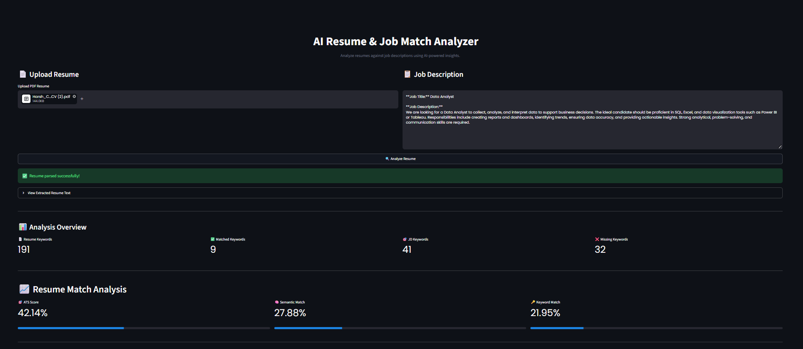
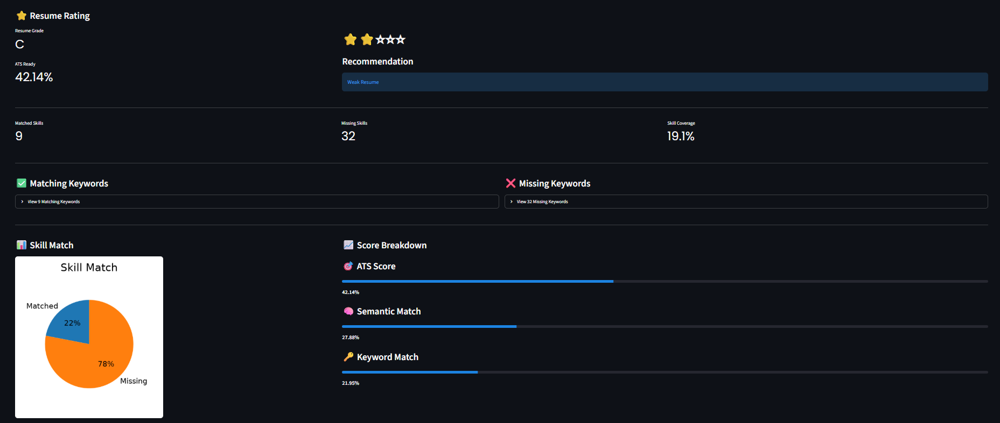
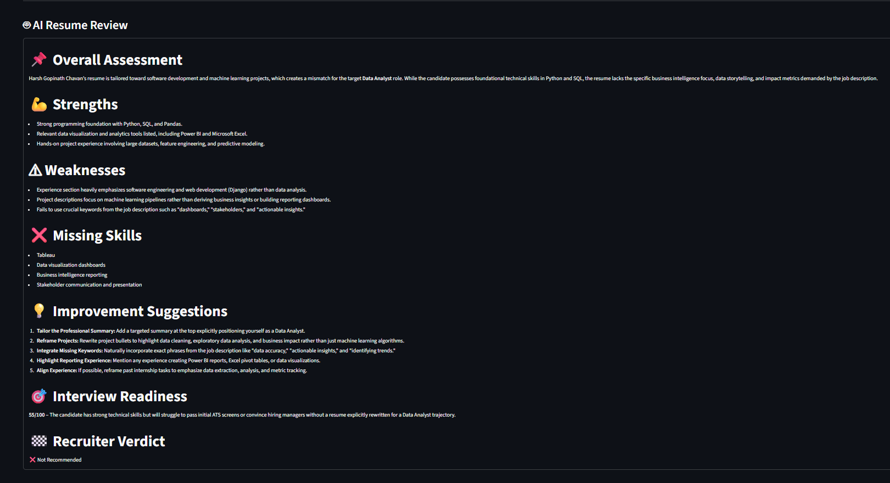
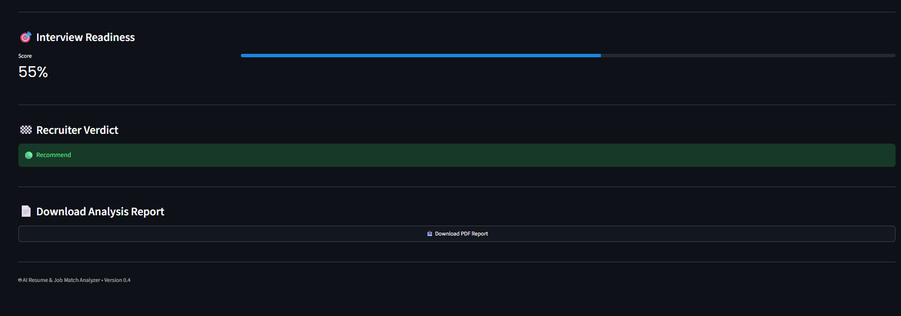

# 📄 AI Resume Analyzer


An AI-powered Resume Analysis application that evaluates resumes against job descriptions using **Natural Language Processing (NLP)**, **Machine Learning**, and **Large Language Models (LLMs)**. The application provides ATS compatibility scores, keyword matching, resume grading, AI-generated feedback, and downloadable PDF reports through an interactive Streamlit interface.

---

# 📌 Overview

Recruiters spend only a few seconds reviewing each resume, and many companies rely on Applicant Tracking Systems (ATS) to filter candidates before a human even sees the application.

AI Resume Analyzer helps job seekers optimize their resumes by comparing them with a target Job Description (JD). The system identifies missing keywords, calculates semantic similarity, evaluates ATS compatibility, provides AI-powered suggestions, assigns a resume grade, and generates a professional PDF report.

The application combines traditional NLP techniques with modern AI feedback to simulate a real-world resume screening process.

---

# 🚀 Live Demo

### 🌐 Streamlit Cloud

> **Coming Soon**

(Replace this section with your deployed Streamlit URL after deployment.)

---

# 📸 Application Preview

### Home Page



### ATS Score Analysis


### Resume Rating Dashboard



### AI Resume Review



### PDF Report



---

# ✨ Features

- 📄 Upload Resume (PDF)
- 💼 Paste Job Description
- 🤖 AI-powered Resume Review
- 📊 ATS Compatibility Score
- 🔍 Keyword Matching Analysis
- 📈 Resume-JD Semantic Similarity
- 📝 Resume Section Detection
- ⭐ Resume Quality Grading (A–F)
- 💡 Personalized Improvement Suggestions
- 📥 Download Professional PDF Report
- 🎨 Interactive Streamlit Dashboard
- ⚡ Fast Resume Processing

---

# 🧠 Resume Analysis Workflow

```text
                Resume (PDF)
                      │
                      ▼
              Text Extraction (PyMuPDF)
                      │
                      ▼
              Text Cleaning & Processing
                      │
                      ▼
        Resume + Job Description Comparison
                      │
      ┌───────────────┼────────────────┐
      ▼               ▼                ▼
Keyword Match   Semantic Similarity   Section Analysis
      │               │                │
      └───────────────┼────────────────┘
                      ▼
              ATS Score Calculation
                      │
                      ▼
             Resume Grade Assignment
                      │
                      ▼
           AI-powered Resume Feedback
                      │
                      ▼
          Professional PDF Report
```

---

# 🛠️ Tech Stack

| Category | Technology |
|-----------|------------|
| Language | Python |
| Framework | Streamlit |
| NLP | NLTK |
| Machine Learning | Scikit-learn |
| Data Processing | Pandas, NumPy |
| PDF Processing | PyMuPDF |
| Visualization | Altair |
| AI Integration | Google Gemini API |
| Report Generation | ReportLab |

---

# 📂 Project Structure

```text
AI-Resume-Analyzer/
│
├── app.py
├── requirements.txt
├── README.md
├── .gitignore
├── .env.example
│
├── assets/
│   └── styles.css
│
├── images/
│   ├── home_page.png
│   ├── ats_score_analysis.png
│   ├── resume_rating_dashboard.png
│   ├── ai_resume_review.png
│   └── pdf_report_download.png
│
├── reports/
│   └── .gitkeep
│
├── sample_data/
│   ├── resumes/
│   └── job_descriptions/
│
└── utils/
    ├── ai_review.py
    ├── ats_score.py
    ├── charts.py
    ├── keyword_matcher.py
    ├── pdf_report.py
    ├── resume_grade.py
    ├── section_checker.py
    ├── similarity.py
    ├── suggestions.py
    └── text_processor.py
```

---

# 🚀 Installation

## Clone Repository

```bash
git clone https://github.com/harsh8767/AI-Resume-Analyzer.git
```

## Navigate into Project

```bash
cd AI-Resume-Analyzer
```

## Create Virtual Environment

Windows

```bash
python -m venv venv
venv\Scripts\activate
```

Linux / macOS

```bash
python3 -m venv venv
source venv/bin/activate
```

## Install Dependencies

```bash
pip install -r requirements.txt
```

---

# 🔑 Environment Variables

Create a `.env` file in the project root.

```env
GOOGLE_API_KEY=your_google_gemini_api_key
```

---

# ▶️ Run the Application

```bash
streamlit run app.py
```

The application will be available at

```
http://localhost:8501
```

---

# 📊 Evaluation Metrics

The analyzer evaluates resumes using multiple criteria:

- ATS Compatibility Score
- Resume-JD Similarity Score
- Keyword Match Percentage
- Resume Completeness
- Resume Structure
- Missing Keywords
- Resume Grade
- AI-generated Feedback

---

# 📋 Sample Files

The repository includes sample resumes and job descriptions for testing.

```
sample_data/
├── resumes/
└── job_descriptions/
```

These files can be used to quickly explore the application's functionality without creating your own inputs.

---

# ⚠️ Known Limitations

- Supports PDF resumes only.
- AI feedback quality depends on the LLM response.
- ATS scoring is heuristic-based and may differ from commercial ATS software.
- Keyword matching cannot fully capture recruiter preferences.

---

# 🚀 Future Improvements

- DOCX Resume Support
- Resume History
- User Authentication
- Multiple Resume Comparison
- Resume Templates
- Cover Letter Generator
- Job Recommendation System
- Resume Version Tracking
- Interview Question Generator
- Dark Mode

---

# 🙏 Acknowledgements

- Streamlit
- Scikit-learn
- NLTK
- PyMuPDF
- Google Gemini API
- ReportLab

---

# 👨‍💻 Developer

**Harsh Chavan**

Computer Engineering Graduate

GitHub: https://github.com/harsh8767

LinkedIn: https://www.linkedin.com/in/harsh-chavan-1646a2257/

---

# 📜 License

This project is licensed under the MIT License.